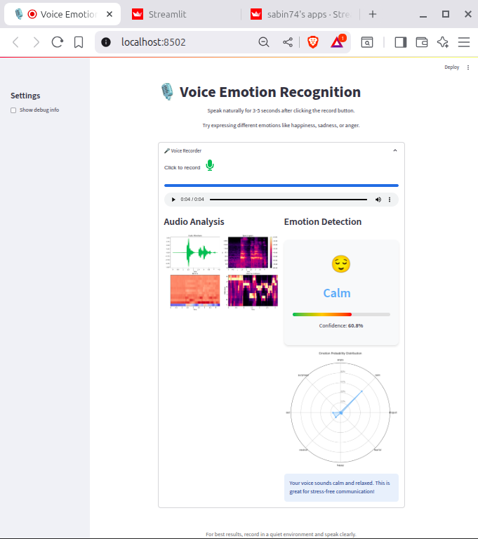

# Audio Emotion Recognition with Streamlit

A Python-based application for real-time emotion detection from audio recordings, built with Streamlit and machine learning libraries.

 *(Optional: Add screenshot path)*

## Features
- 🎤 Live audio recording & emotion analysis
- 🧠 ML-powered emotion detection (e.g., happy, sad, angry)
- 📊 Interactive visualization with Plotly/Matplotlib
- 🚀 Easy deployment to Streamlit

## System Requirements
- Python 3.10.x (recommended: 3.10.18)
- 4GB+ RAM (for ML models)
- FFmpeg (for audio processing)

## Installation

### 1. Clone Repository
```bash
git clone https://github.com/yourusername/audio-emotion-recognition.git
cd audio-emotion-recognition
